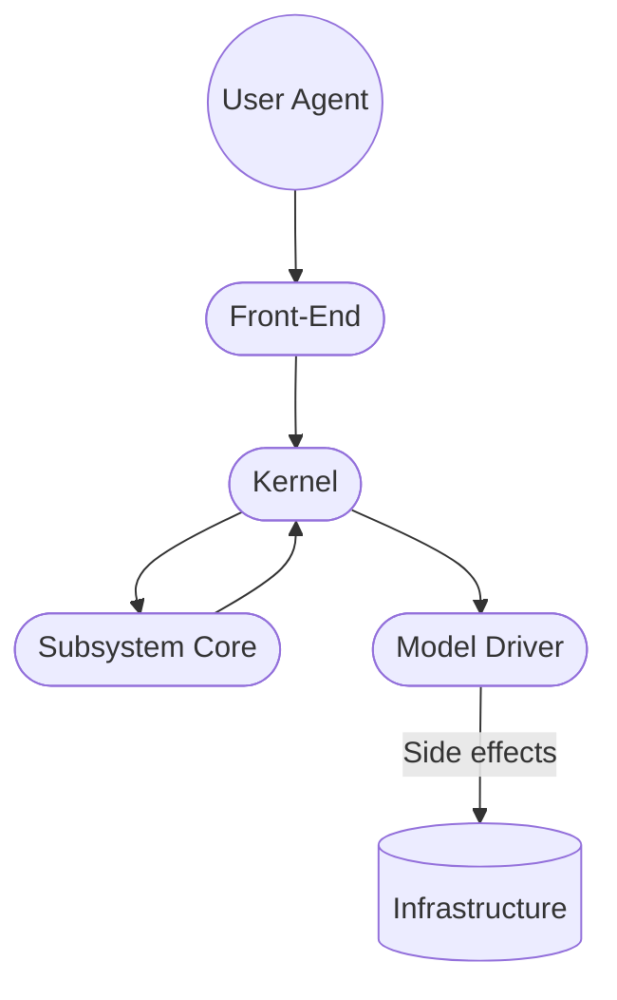
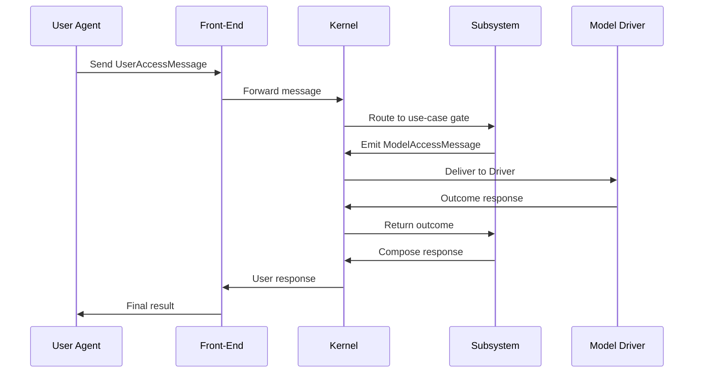

# Commercial Extensions Platform — Clean Architecture Design

## Overview

- Purpose of the document
- Target audience
- Context and scope

## 1. Design Philosophy

- Clean Architecture principles
- Port-and-Adapters foundation
- Message-driven architecture
- Statelessness and functional purity
- Subsystem modularity
- Explicit backdoors for pragmatic flexibility

## 2. Architectural Layers

- Layer definitions and roles
- Layer interaction flow
- Error propagation strategy

## 3. Subsystems

- Definition and purpose
- Internal structure (Gates, Interactors, Plugins, Model Messages)
- Access tree definitions (user-facing and model-facing)
- Functional boundaries and naming
- Lifecycle and startup behavior

## 4. Kernel

- Responsibilities
  - Boot and wiring
  - Access routing
  - Middleware and plugin integration
  - Message flow orchestration
- Error routing and status semantics
- Backdoor support

## 5. Messaging Protocol

- Message format and structure
  - UserAccessMessage
  - ModelAccessMessage
- Path-based routing
- Transport-agnostic design
- Error response structure (HTTP-style)
- Event emission for observability and CQRS

## 6. Model Drivers

- Role and responsibilities
- Transport flexibility
- Subsystem DSL awareness
- Deployment separation strategies

## 7. Middleware & Plugins

- Middleware lifecycle and hooks
- Behavior overrides and extensions
- Plugin dependency graph
- Ordering and deterministic loading

## 8. Deployment Model

- Subsystem colocation
- Driver distribution
- Kernel as runtime orchestrator
- Transport protocol binding
- Configuration injection points

## 9. Testing Strategy

- Core testing via message simulation
- Use-case level determinism
- Driver mocking and substitution
- Subsystem isolation for testing
- Container-level integration tests

## 10. Future Extensions

- Message contract versioning
- Subsystem feature flags
- Multi-transport scenarios
- Runtime reconfigurability
- Dev tooling and introspection

## Appendix

- Glossary of terms
- Message and type examples
- Reference links
